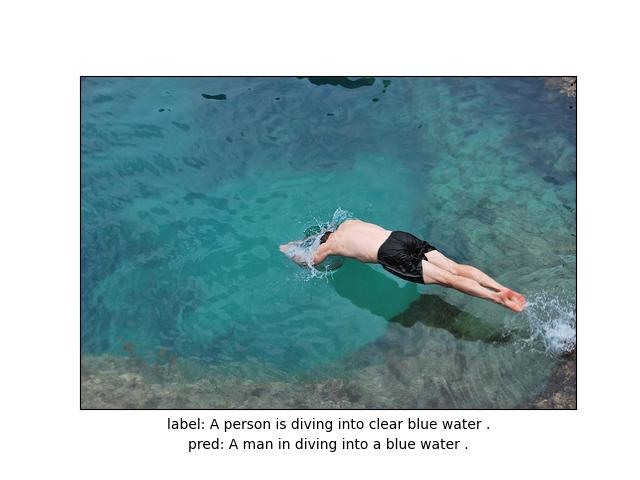
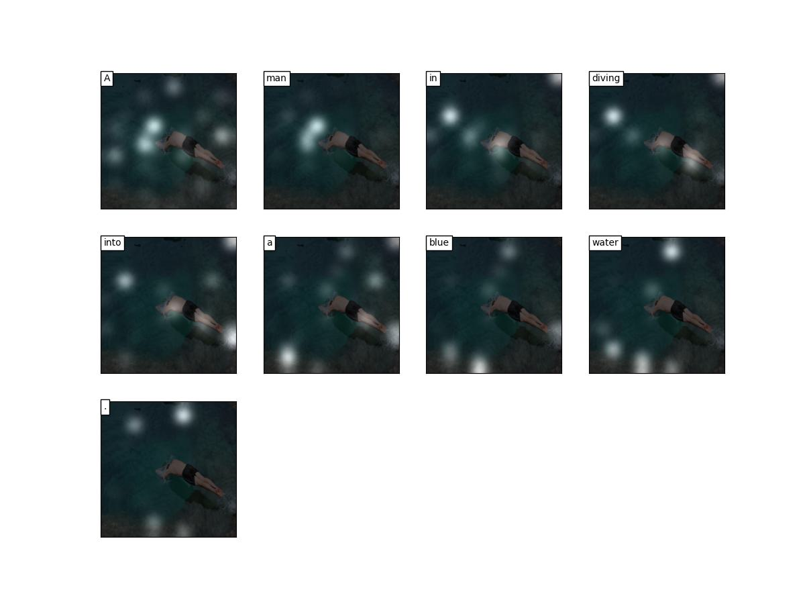
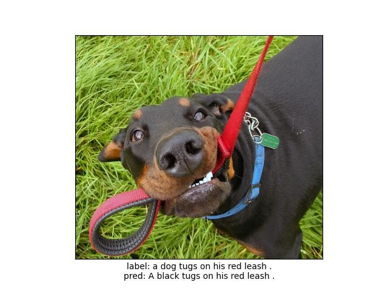
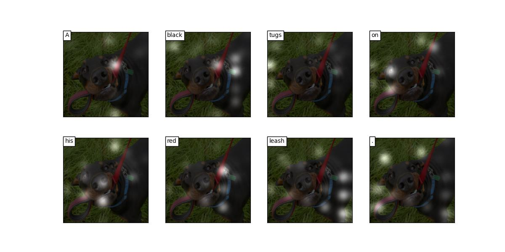
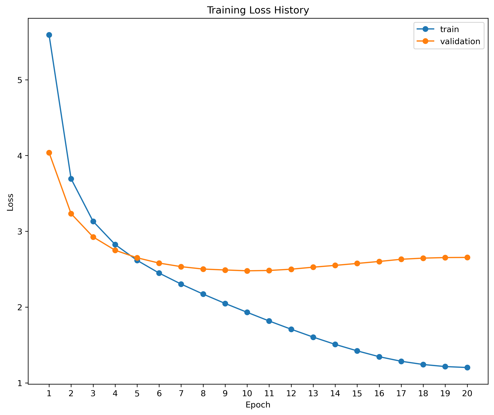
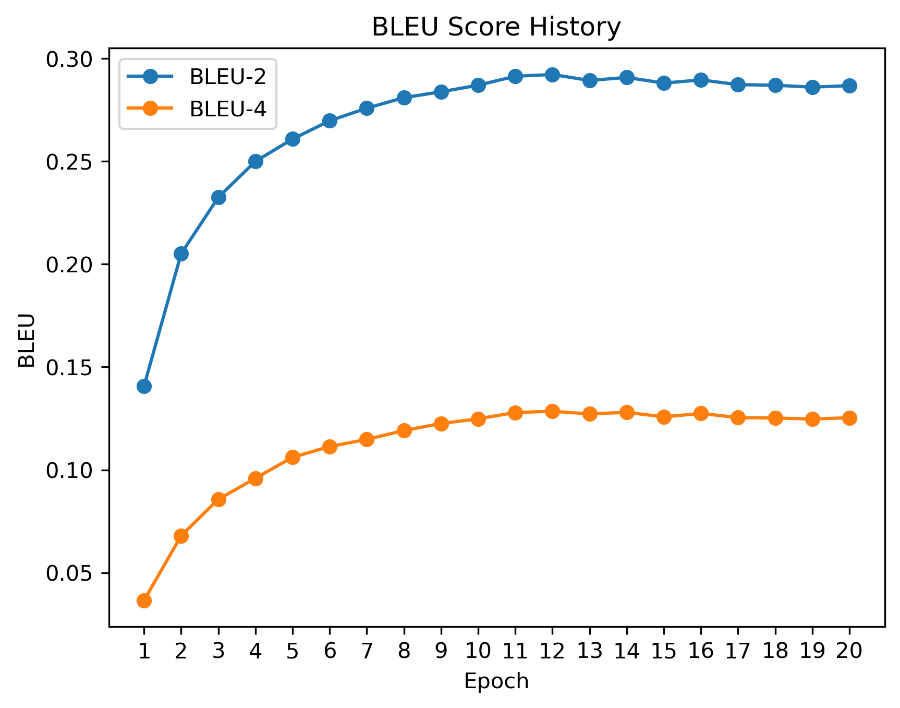
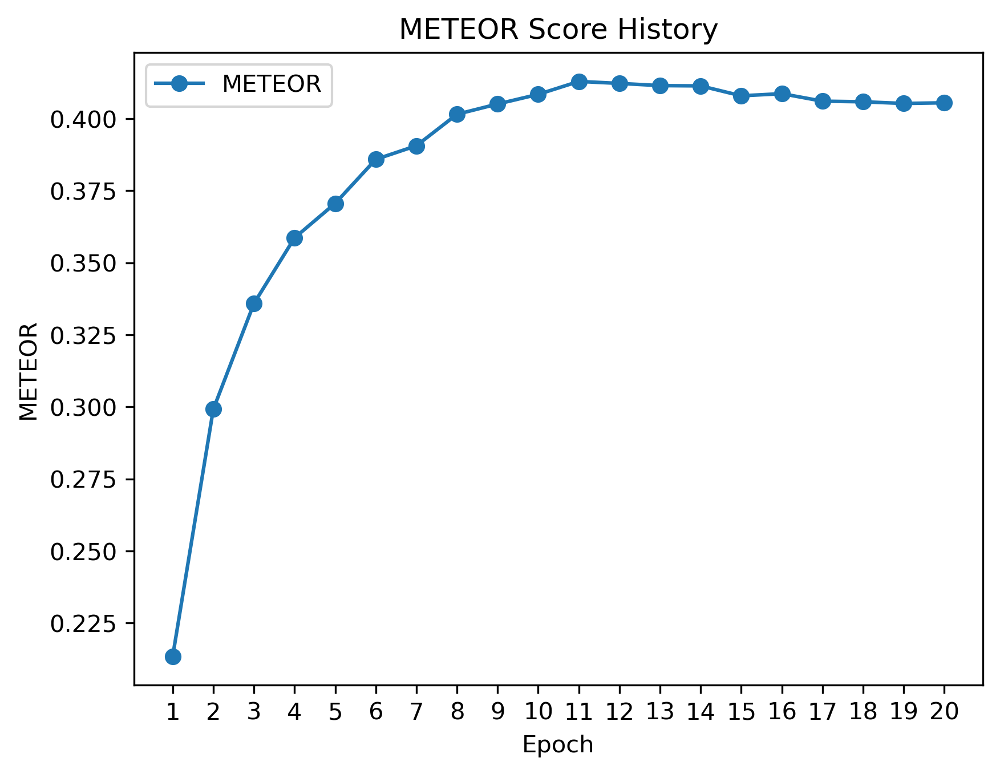

# Show,Attend and Tell

Show,Attend and Tell 논문에 대한 설명은 [블로그](https://velog.io/@khs0415p/Paper-Show-Attend-and-Tell)를 참고하시기 바랍니다.  

## Abstract

Captioning은 이미지에 대한 적절한 설명을 생성하는 Task입니다.  
Show, Attend and Tell의 논문에서는 Encoder로 CNN을 사용하여 이미지에 대한 feature를 추출하고 Attention을 통한 정보를 Decoder에서 사용하여 이전의 연구보다 향상 된 성능을 보여줍니다.  
Encoder로는 사전학습 된 Resnet을 사용하고, Decoder로는 LSTM을 사용합니다.  
작성 된 코드는 [a-PyTorch-Tutorial-to-Image-Captioning](https://github.com/sgrvinod/a-PyTorch-Tutorial-to-Image-Captioning/tree/master)를 참고해 작성되었습니다.


## Dataset

사용 된 데이터는 *Flicakr8K* 약 4만개의 caption정보와 그에 맞는 이미지가 주어집니다.  
정확한 데이터 구성은 `data_samples/` 아래를 참고하시기 바랍니다.


## Tree

```
.
├── config
│   └── config.yaml             # config file
│
├── models
│   ├── __init__.py
│   └── models.py               # Show,Attend and Tell modeling file
│
├── results                     # folder for save model
│
│
├── trainer
│   ├── __init__.py
│   ├── base.py                 # base trainer file
│   └── trainer.py              # Show, Attend and Tell trainer
│
├── utils
│   ├── __init__.py
│   ├── data_utils.py           # dataset file
│   ├── file_utils.py           # file for file system
│   ├── metric_utils.py         # file for bleu score
│   └── train_utils.py          # file for training
│
├── requirements.txt
│
└── main.py                     # file for running
```

## Start

### Train
```
python main.py --config config/config.yaml
```

### Test
```
python main.py --mode test --checkpoint <checkpoint folder>
```

#### Test samples

**Sample 1.**




<br>

**Sample 2.**




## Results

### Loss History



### BLEU Score History



### METEOR Score History

